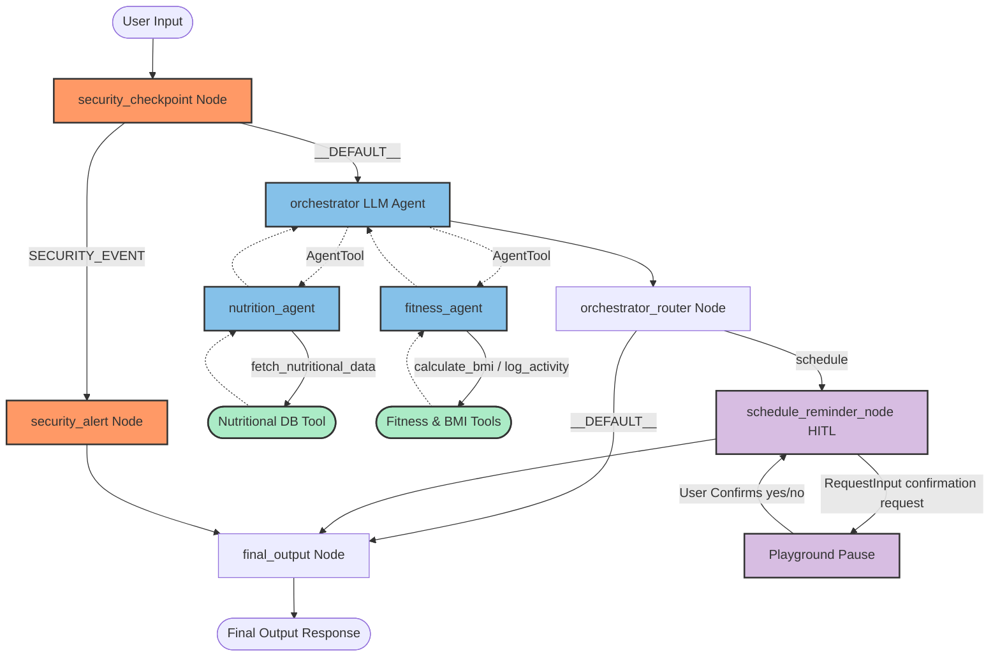
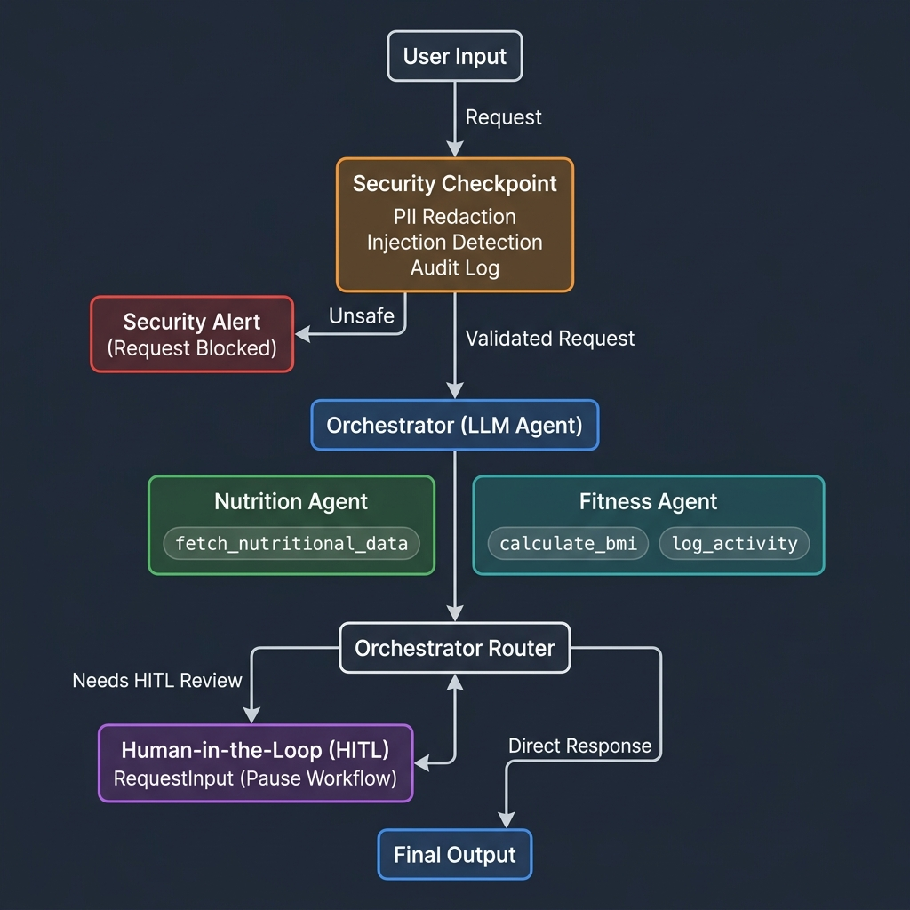

# 📝 Submission Writeup — Health Concierge

This writeup documents the design, implementation, and architectural choices for the **Health Concierge** application, built using the **Google Agent Development Kit (ADK) 2.0**.

---

## 1. Problem Statement

Modern individuals face a fragmented health and wellness landscape. Information is scattered across specialized domains—nutritional values, calorie burning calculations, BMI statistics, and workout planning. When trying to coordinate daily health routines, users either consult static databases, use single-purpose calculators, or use general-purpose LLMs that lack domain grounding and can hallucinate factual metrics.

Furthermore, integrating automation (such as medication or workout scheduling) introduces safety risks if agents can perform tasks without human oversight. Lastly, exposing personal wellness and medical details to large language models poses serious privacy and security concerns (PII leaks, prompt injections, and unsafe health queries).

The **Health Concierge** addresses these challenges by providing:
1. **Domain-Grounded Guidance**: Specialized agents for Nutrition and Fitness powered by tools.
2. **Deterministic Security**: Pre-execution scrubbing of PII, detection of jailbreaks, and structured audit logs.
3. **Safety-Guaranteed Automation**: A Human-in-the-Loop approval step for reminder scheduling.

---

The application is structured as a hierarchical multi-agent workflow directed by a security gate and a keyword router.





### Workflow Lifecycle:
1. **User Input** enters the system.
2. The input passes through `security_checkpoint` (a deterministic Python node) before any LLM execution.
   - If a threat is detected, it is routed to `security_alert` to block the interaction.
   - If safe, the scrubbed input proceeds to the **Orchestrator**.
3. The **Orchestrator** (an `LlmAgent` using `AgentTool`) classifies the query and delegates it to either the **Nutrition Agent** or the **Fitness Agent**.
4. The specialist agents execute relevant functions (`calculate_bmi`, `fetch_nutritional_data`, or `log_activity`) to ground their responses.
5. The combined result is passed to `orchestrator_router`.
   - If the Orchestrator detected scheduling intent, it routes to `schedule_reminder_node` (HITL).
   - Otherwise, it routes directly to `final_output` for display.

---

## 3. ADK Concepts & Code References

The implementation utilizes the following primary ADK concepts:

| ADK Concept | Purpose | Code Reference |
|---|---|---|
| **Workflow** | Declares nodes and routes them conditionally using the ADK 2.0 dictionary-edge format. | [app/agent.py:182-192](file:///e:/agy2-projects/Capstone-Project-2026/adk-workspace/health-concierge/app/agent.py#L182-L192) |
| **LlmAgent** | The core LLM agents (`orchestrator`, `nutrition_agent`, `fitness_agent`) configured with distinct system prompts and tools. | [app/agent.py:31-65](file:///e:/agy2-projects/Capstone-Project-2026/adk-workspace/health-concierge/app/agent.py#L31-L65) |
| **AgentTool** | Wraps sub-agents so they can be exposed as tools to the Orchestrator. | [app/agent.py:63](file:///e:/agy2-projects/Capstone-Project-2026/adk-workspace/health-concierge/app/agent.py#L63) |
| **RequestInput** | Interrupts workflow execution to request confirmation from the user (HITL). | [app/agent.py:154-162](file:///e:/agy2-projects/Capstone-Project-2026/adk-workspace/health-concierge/app/agent.py#L154-L162) |
| **ResumabilityConfig** | Configures the app session db to enable resuming workflows from user interrupts. | [app/agent.py:197](file:///e:/agy2-projects/Capstone-Project-2026/adk-workspace/health-concierge/app/agent.py#L197) |
| **Function Nodes** | Deterministic Python code blocks run as nodes in the workflow (`security_checkpoint`, `orchestrator_router`, etc.). | [app/agent.py:68-146](file:///e:/agy2-projects/Capstone-Project-2026/adk-workspace/health-concierge/app/agent.py#L68-L146) |

---

## 4. Security Design

Exposing medical or wellness systems to LLMs requires defensive layers. The **Security Checkpoint** ([app/agent.py:68-111](file:///e:/agy2-projects/Capstone-Project-2026/adk-workspace/health-concierge/app/agent.py#L68-L111)) provides:

1. **PII Scrubbing**:
   - Uses regex to find and redact emails (`[EMAIL_REDACTED]`), phone numbers (`[PHONE_REDACTED]`), and medical ID patterns like Medical Record Numbers (`[MEDICAL_ID_REDACTED]`).
2. **Prompt Injection Defense**:
   - Blocks jailbreak patterns (such as `"ignore safety"`, `"override instructions"`, `"bypass security"`) deterministically at the workflow entrance, preventing LLM exploitation.
3. **Domain Safety**:
   - Implements self-harm keyword filters (e.g., `"kill myself"`, `"overdose"`) to route users to professional help instead of generating health advice.
4. **Structured Audit Logging**:
   - Emits structured JSON events on standard output for ingestion by SIEM/logging collectors:
     ```json
     {"severity": "INFO", "timestamp": "...", "session_id": "...", "pii_detected": false, "injection_detected": false, "unsafe_health_detected": false}
     ```

---

## 5. MCP Server Design

The Model Context Protocol (MCP) server is defined in [app/mcp_server.py](file:///e:/agy2-projects/Capstone-Project-2026/adk-workspace/health-concierge/app/mcp_server.py). It exposes three key tools:

1. **`calculate_bmi(weight_kg: float, height_cm: float) -> str`**:
   - Calculates the Body Mass Index and maps it to standard health categories (Underweight, Normal weight, Overweight, Obese).
2. **`fetch_nutritional_data(query: str) -> str`**:
   - Queries a localized nutritional database to retrieve exact calories, carbs, protein, and fat counts.
3. **`log_activity(activity_type: str, duration_min: float) -> str`**:
   - Uses metabolic equivalent task (MET) values for specific activities to calculate calories burned.

---

## 6. Human-in-the-Loop (HITL) Flow

Reminders (medication schedules, workout classes, meal preps) modify external state or send notifications, meaning they require explicit authorization.

In [app/agent.py:149-170](file:///e:/agy2-projects/Capstone-Project-2026/adk-workspace/health-concierge/app/agent.py#L149-L170):
1. When the Orchestrator identifies a request to schedule a reminder, it appends a structured marker `SCHEDULING_REQUEST: <reminder details>` to its output.
2. The `orchestrator_router` parses the output. If the marker is present, it routes the workflow to `schedule_reminder_node`.
3. The node detects that no human confirmation has been received yet, yields a `RequestInput(interrupt_id="confirm_schedule", ...)` event, and pauses execution.
4. The user receives the prompt in the UI/CLI. When they respond with `"yes"` or `"no"`, the ADK runner resumes the session and passes the input back to the node, completing the scheduling loop securely.
